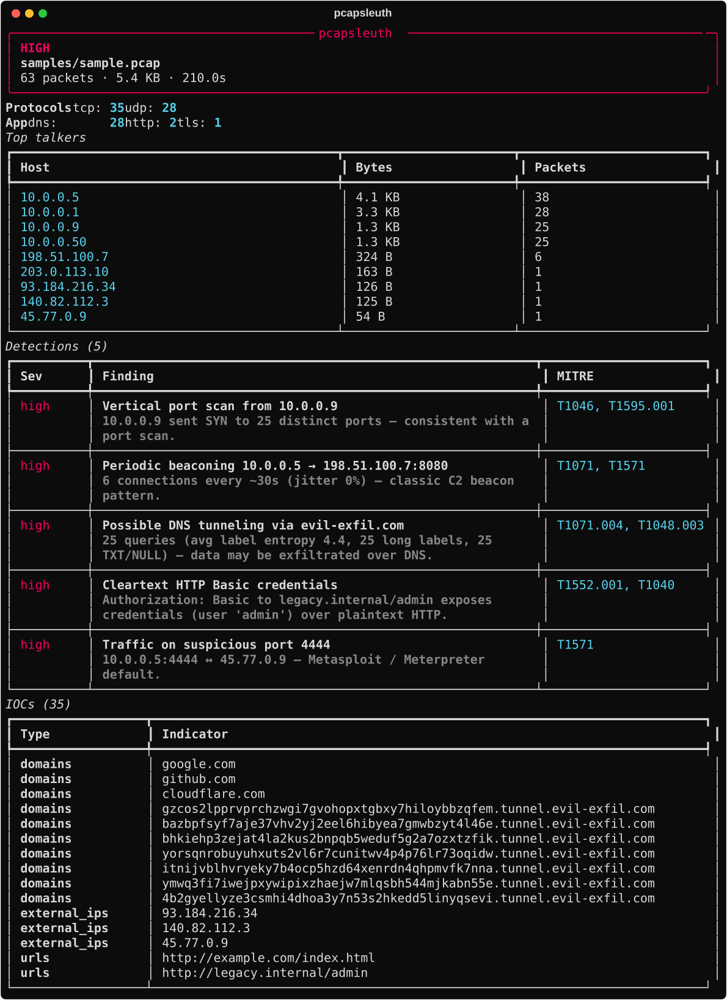

# 🛰️ pcapsleuth

> A **network traffic analyzer** for blue teams. Point it at a `.pcap` / `.pcapng` capture and it reconstructs the flows, pulls out DNS/HTTP/TLS and IOCs, and flags suspicious behaviour — **port scans, C2 beaconing, DNS tunneling, cleartext credentials, backdoor ports, data egress** — each mapped to **MITRE ATT&CK**.

Opening a capture in Wireshark tells you *what packets there are*. `pcapsleuth` tells you *what's interesting* — the first-pass network triage an analyst does before diving into individual packets.



---

## ✨ Features

- **Capture summary** — packets, bytes, duration, protocol & app-protocol breakdown, reads both `.pcap` and `.pcapng`.
- **Flows & top talkers** — 5-tuple conversations and the busiest hosts by bytes/packets.
- **Detections** (each mapped to MITRE ATT&CK):
  - 🔭 **Port scans** — vertical (many ports) and horizontal (many hosts) — `T1046`
  - 📡 **C2 beaconing** — periodic connections with low jitter — `T1071` / `T1571`
  - 🕳️ **DNS tunneling** — long / high-entropy labels, TXT/NULL floods — `T1071.004` / `T1048`
  - 🔓 **Cleartext credentials** — HTTP Basic auth (username decoded), Telnet/FTP sessions — `T1552` / `T1040`
  - ☠️ **Backdoor ports** — Metasploit 4444, NetBus, IRC botnet, etc. — `T1571`
  - 📤 **Large egress** — bulk outbound transfer to external hosts — `T1041` / `T1048`
- **IOC extraction** — domains (DNS + TLS SNI + HTTP Host), external IPs and URLs, deduplicated — ready to pipe into [IOC Hunter](https://github.com/defamp/ioc-hunter).
- **Four outputs** — rich **console**, **Markdown**, standalone **HTML**, and **JSON** (`--iocs-only` for just the indicators).
- **Pipeline-friendly** — exits `1` on a `HIGH`/`CRITICAL` verdict.

## 🚀 Installation

```bash
git clone https://github.com/defamp/pcapsleuth
cd pcapsleuth
pip install -e .
```

Python 3.8+. Dependencies: [`dpkt`](https://github.com/kbandla/dpkt) (parsing) and [`rich`](https://github.com/Textualize/rich) (output). No external services, no API keys — fully offline.

## 🧪 Usage

```bash
pcapsleuth capture.pcap                 # console triage
pcapsleuth capture.pcap -f md -o out.md # Markdown for a ticket
pcapsleuth capture.pcap -f html -o out.html
pcapsleuth capture.pcap -f json --iocs-only | jq '.domains[]'
```

Try the bundled example (one clean instance of every detection):

```bash
pcapsleuth samples/sample.pcap
```

| Flag | Description |
| --- | --- |
| `-f, --format {term,md,html,json}` | Output format (default `term`). |
| `-o, --output FILE` | Write to a file. |
| `--top N` | Rows per table (default 10). |
| `--iocs-only` | With `-f json`, emit just IOCs. |
| `--no-fail` | Always exit 0. |

Exit codes: `0` ok · `1` HIGH/CRITICAL verdict · `2` input error.

## 🏗️ How it works

```
capture.pcap ─▶ reader.py     dpkt: pcap/pcapng → dissected packets
             ─▶ analyzer.py   flows, DNS/HTTP/TLS, talkers, IOCs
             ─▶ detections.py scan / beacon / tunnel / creds / egress  → MITRE
             ─▶ report.py     term / md / html / json
```

The synthetic `samples/sample.pcap` is regenerated by `scripts/make_sample.py`, so every detection has a deterministic test.

## ✅ Tests

```bash
pip install -e ".[dev]"
pytest
```

## 🧩 Where it fits

`pcapsleuth` adds the **network** layer to the toolkit — alongside [logsleuth](https://github.com/defamp/logsleuth) (logs), [maltriage](https://github.com/defamp/maltriage) (sandbox reports) and [ioc-hunter](https://github.com/defamp/ioc-hunter) (IOC enrichment).

## ⚠️ Disclaimer

Heuristic detections for triage — tune the thresholds in `detections.py` for your environment and confirm findings in the raw packets. Analyze only traffic you are authorised to inspect.

## 📄 License

MIT © Defa Mulya Pratama
